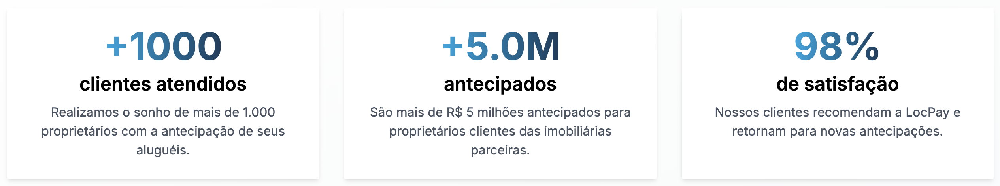

# 💙 LocPay Tech Challenge - Summer Job 2025

Bem-vindo(a) ao **LocPay Tech Challenge**, o case técnico da segunda fase do processo seletivo para o **Summer Job 2025**.

Este desafio foi criado para avaliar sua capacidade de entender um problema de negócio, estruturar uma **solução técnica simples** e bem organizada, e comunicar suas decisões de forma clara.

Nosso objetivo não é medir o quanto você sabe de frameworks, mas sim avaliar sua **clareza de raciocínio**, qualidade de código e capacidade de transformar um problema real em solução funcional.

---

## 🏠 Sobre a LocPay

A **LocPay** é uma fintech focada no mercado de locação imobiliária, oferecendo soluções de antecipação de recebíveis e automação de repasses para imobiliárias, corretores e proprietários.

Atuamos para descomplicar a gestão financeira de aluguéis, tornando os repasses mais rápidos, previsíveis e inteligentes, conectando tecnologia, segurança e experiência do usuário.

<div align="center">
  
</div>

---

## ☀️ Sobre o Summer Job LocPay 2025

O **Summer Job LocPay** é um programa de curta duração que oferece uma imersão prática em tecnologia, produto e negócios dentro de uma fintech em crescimento.

Durante o programa, os selecionados trabalharão em **projetos reais** com acompanhamento técnico, mentorias e participação em decisões de produto, liderados por um Tech Lead do time da LocPay.

Nosso objetivo é proporcionar **aprendizado real e impacto tangível**.

---

## 🧠 Contexto do Desafio

Imagine que você faz parte do time de tecnologia da LocPay.  
Sua missão é criar uma **API simplificada** que permita simular e gerenciar operações de antecipação de aluguel entre recebedores (proprietários) e a LocPay.

Com isso, buscamos entender como você estrutura uma aplicação de backend, organiza regras de negócio e documenta uma API de forma clara e objetiva.

---

## ⚙️ O que você deve construir

Você deve construir um **backend simples**, responsável por armazenar e gerenciar as operações de antecipação.

### Requisitos técnicos

Para o desafio, use apenas o que for necessário.  
Sugerimos simplificar com **Express ou NestJS + SQLite**, sem filas, Redis ou AWS.

### Banco de dados

Um banco de dados (SQLite, PostgreSQL ou outro relacional) com duas tabelas principais:

1. **Recebedores (`receivers`)**
   - `id` — identificador único do recebedor  
   - `name` — nome do recebedor  
   - `balance` — saldo atual do recebedor (inicia em 0)

2. **Operações (`operations`)**
   - `id` — identificador único da operação  
   - `receiver_id` — chave estrangeira para o recebedor  
   - `gross_value` — valor bruto antecipado  
   - `fee` — taxa de antecipação (3%)  
   - `net_value` — valor líquido a ser repassado  
   - `status` — `"pending"` ou `"confirmed"`

### Fluxo de uso esperado

1. O usuário cria uma operação (`POST /operations`) informando o `receiver_id` e o `gross_value`.
2. O backend calcula a taxa (`fee = 3%`) e o valor líquido (`net_value = gross_value - fee`).
3. A operação é salva no banco com status `"pending"`.
4. Ao chamar `POST /operations/:id/confirm`, o status muda para `"confirmed"` e o `net_value` é somado ao saldo do recebedor.

### O que seu backend deve fazer

Seu backend deve expor **endpoints REST** que permitam:

| Rota | Descrição |
|------|------------|
| `POST /operations` | Cria uma nova operação de antecipação. Calcula `fee` e `net_value` automaticamente. |
| `GET /operations/:id` | Retorna os dados completos de uma operação. |
| `POST /operations/:id/confirm` | Confirma uma operação e soma o valor líquido ao saldo do recebedor. |
| `GET /receivers/:id` | Retorna o nome e saldo do recebedor, além do histórico de operações. |

### Regras de negócio

- `fee` = **3%** do valor bruto (`gross_value`).
- `net_value` = `gross_value - fee`.
- Status possíveis: `"pending"` e `"confirmed"`.

### Sugestão de como começar

1. **Modelagem:** comece desenhando o banco de dados no [dbdiagram.io](https://dbdiagram.io) para visualizar as relações entre *Recebedor* e *Operação*.  
2. **Implementação:** transforme o modelo em um schema do **Prisma** (ou similar).  
3. **Lógica de negócio:** implemente as funções para calcular `fee` e `net_value`, e atualizar o status.  
4. **Rotas:** crie os endpoints descritos na seção anterior.  
5. **Teste localmente:** use o Postman, Insomnia ou cURL para validar seus endpoints.  
6. **Documentação:** Crie um arquivo `solucao.md` com instruções claras de execução e exemplos de requests/responses.

### Tempo sugerido

O desafio foi pensado para ser resolvido em **3 a 4 horas**.  
Queremos ver seu **melhor raciocínio**, não necessariamente o projeto mais complexo.

---

## 🏁 Como começar

Para facilitar seu início, o repositório já vem com **dois templates**:

- `nestjs-template/` → NestJS + Prisma + SQLite  
- `express-template/` → ExpressJS + SQLite  

Você não precisa escolher manualmente, temos um script interativo para isso.

### Passos iniciais

1. Clone o repositório e entre na pasta:

   ```bash
   git clone https://github.com/locpayltda/summer-tech-challenge-2025.git
   cd summer-tech-challenge-2025
   ```

2. Rode o script de inicialização:
   - Windows:

    ```bash
    ./comece-aqui.bat
    ```

   - Linux/MacOS:

   ```bash
   chmod +x comece-aqui.sh
   ./comece-aqui.sh
   ```

3. Escolha entre:
    1) NestJS + Prisma
    2) ExpressJS + SQLite

💡 **Dica**: se algo der errado, basta dar um git restore . ou git clone novamente e rodar o script de novo.

---

## 🧮 Avaliação

| Critério | Pontos |
|-----------|--------|
| Funcionalidade e rotas principais | 40 |
| Lógica de negócio correta | 20 |
| Clareza e organização do código | 20 |
| Documentação (README e exemplos de uso) | 10 |
| Extras (testes, Docker, UI simples etc.) | 10 |
| **Total** | **100 pontos** |

---

## ⚖️ Regras do Desafio

Para garantir igualdade entre os participantes, siga atentamente as regras abaixo:

1. **Uso de Inteligência Artificial:**  
   - É permitido usar IA (como ChatGPT, Copilot etc.) **apenas** para tirar dúvidas conceituais ou revisar código, não para gerar a solução completa automaticamente.  
   - O objetivo é entender seu raciocínio e estilo de implementação.

2. **Autoria:**  
   - O código deve ser inteiramente seu.  
   - Códigos copiados ou plagiados de outros repositórios públicos podem desclassificar a candidatura.

---

## ✅ Entrega

Para entregar seu desafio, você precisa seguir os passos abaixo, leia atentamente:

- O prazo para entrega está descrito no e-mail recebido convocando para a fase de desafio técnico.
- Crie um arquivo `solucao.md` com instruções claras de execução e exemplos de requests/responses.
- Repositórios privados não serão considerados, garanta que seu repositório esteja **público**.
- Envie o link do seu repositório **público** para: `tech@locpay.com.br` com o assunto: `[Summer Job 2025] Entrega Case Técnico`

---

## 📬 Suporte

Em caso de dúvidas durante o desafio, envie um e-mail para: <tech@locpay.com.br>
Assunto: `[Summer Job 2025] Dúvida Case Técnico`

---

**Boa sorte!** 💙
Equipe LocPay Tech
