# Simulação de Operações de Antecipação - LocPay

## 1. Introdução 

Este projeto foi construído por mim, [Lívia Tavares](https://www.linkedin.com/m/in/livia-saboia-tavares/), e é uma aplicação web interativa que simula operações de antecipação de aluguel entre recebedores (proprietários) e a LocPay. Ele inclui:

- Interface web estilizada
- CRUD completo de recebedores
- Criação e confirmação de operações
- Cálculo automático de taxas no back-end
- Persistência de dados em SQLite
- Templates EJS com layout reutilizável
- Testes via Postman
- Exemplos de uso

## 2. Arquitetura do Projeto

Abaixo, segue a estrutura de pastas utilizada. Essa API foi desenvolvida integrando front e back-end utilizando ExpressJS e SQLite. 

```
├── app.js
├── solucao.md
├── .gitignore
├── public/
├── config/
├── database/
├── views/
│ ├── layout.ejs
│ ├── index.ejs
│ ├── receivers/
│ └── operations/
├── controllers/ 
├── models/ 
└── routes/

```
- O arquivo `app.js` contém as principais definições iniciais dessa API.

- O arquivo `solucao.md` contém as descrições que você está lendo no momento.

- O arquivo .gitignore serve para ignorar certos arquivos que podem conter informações sensíveis, como a pasta `node-modules` e o arquivo `.env`.

- A pasta `/public` contém imagens que foram utilizadas no projeto.

- A pasta `/views` contém as páginas EJS que integram o front-end do projeto.

- A pasta `/controllers` contém os arquivos que definem a lógica das rotas. Existem dois controllers, sendo um para operações e outro para recebedores.

- A pasta `/models` contém o acesso ao banco SQLite, e foi dividida em dois models, um para as operações e outro para os recebedores.

- A pasta `/routes` contém a definição das rotas express utilizadas, sendo uma geral, uma para as operações e uma para os recebedores.

- O arquivo `database.db` é criado automaticamente pelo SQLite e fica dentro da pasta `database`.

## 3. Tecnologias Utilizadas

| Área | Tecnologia |
|------|------------|
| Backend | Node.js, Express |
| Views | EJS + Express-EJS-Layouts |
| Banco | SQLite + better-sqlite3 |
| Frontend | HTML, CSS, Bootstrap |
| Outros | dbdiagram.io (para fazer o diagrama) |

## 4. Etapas do desenvolvimento 

Para desenvolver essa aplicação, segui alguns passos que me ajudaram na hora da organização do projeto.

### 4.1. Diagramas

Utilizando o dbdiagram.io, criei um diagrama das tabelas do banco de dados para facilitar o entendimento do fluxo, que pode ser visto abaixo.

<div align="center">
<sub>Figura 01: Diagrama das tabelas.</sub>
</div>
<div align="center">
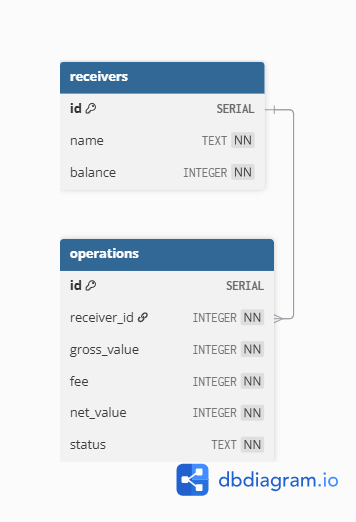
</div>

<div align="center">
<sub>Fonte: dbdiagram.io</sub>
</div>

Assim, ficou mais fácil de notar as relações de PK e de FK.

### 4.2. Estrutura básica de pastas

Nessa etapa, criei a estrutura de pastas pensando diretamente na arquitetura MVC (model view controller), que utilizaria também operações de CRUD (create, read, update e delete) via endpoints.

### 4.3. Desenvolvimento da lógica matemática de negócios

Adicionei a lógica da taxa no `operationController`. O trecho de código abaixo recebe o `gross_value` inserido pelo cliente, transforma em centavos multiplicando o valor por 100 (isso é importante para garantir que a taxa seja aplicada devidamente, já que os valores de balance são inteiros), aplica a taxa e depois calcula `net_value`, que é o valor líquido que será mostrado depois para o usuário.

```js
    static create(req, res) {
        const { receiver_id } = req.body;

        if (!receiver_id) {
            return res.status(400).send("Recebedor inválido.");
        }

        const grossReais = Number(req.body.gross_value);
        if (isNaN(grossReais) || grossReais <= 0) {
            return res.status(400).send("Valor bruto inválido.");
        }

        const gross_value = Math.round(grossReais * 100);

        const fee = Math.round(gross_value * 0.03);
        const net_value = gross_value - fee;

        const op = Operation.create({
            receiver_id,
            gross_value,
            fee,
            net_value
        });

        res.redirect(`/operations/${op.id}`);
    }
```

### 4.4. Testes de API

Após desenvolver a lógica acima e estruturar devidamente o modelo MVC do projeto, realizei testes de endpoints usando Postman, para garantir que a API estava funcionando. Abaixo, podem-se ver alguns prints de testes que eu realizei, com `GET` e com `POST`. 

<div align="center">
<sub>Figura 02: Primeiro teste com GET.</sub>
</div>
<div align="center">
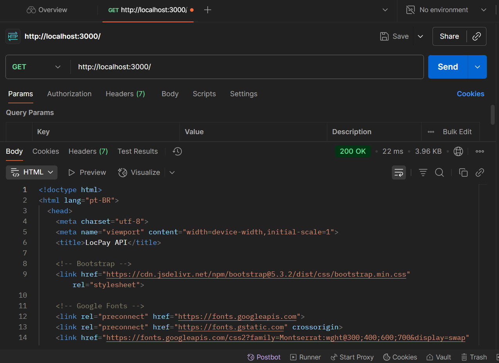
</div>

<div align="center">
<sub>Fonte: Postman</sub>
</div>

<div align="center">
<sub>Figura 03: Segundo teste com GET.</sub>
</div>
<div align="center">
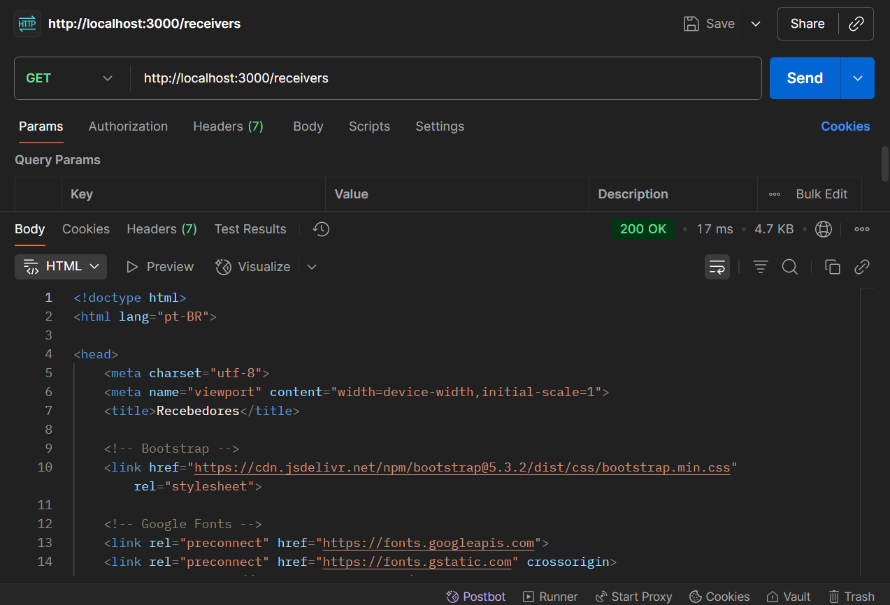
</div>

<div align="center">
<sub>Fonte: Postman</sub>
</div>

<div align="center">
<sub>Figura 04: Terceiro teste com GET.</sub>
</div>
<div align="center">
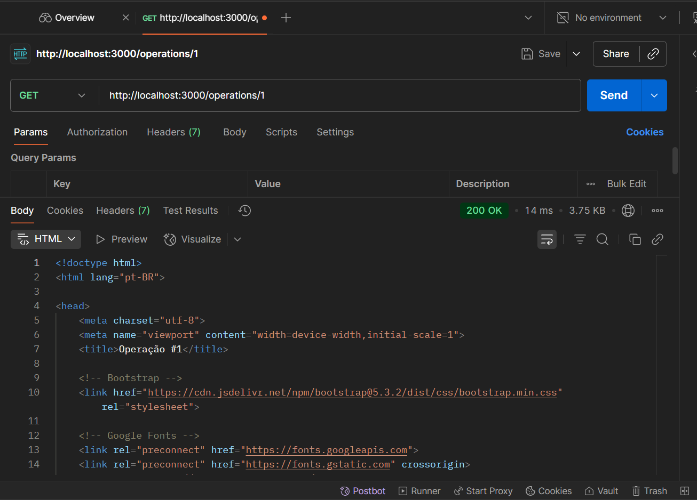
</div>

<div align="center">
<sub>Fonte: Postman</sub>
</div>

<div align="center">
<sub>Figura 05: Primeiro teste com POST.</sub>
</div>
<div align="center">
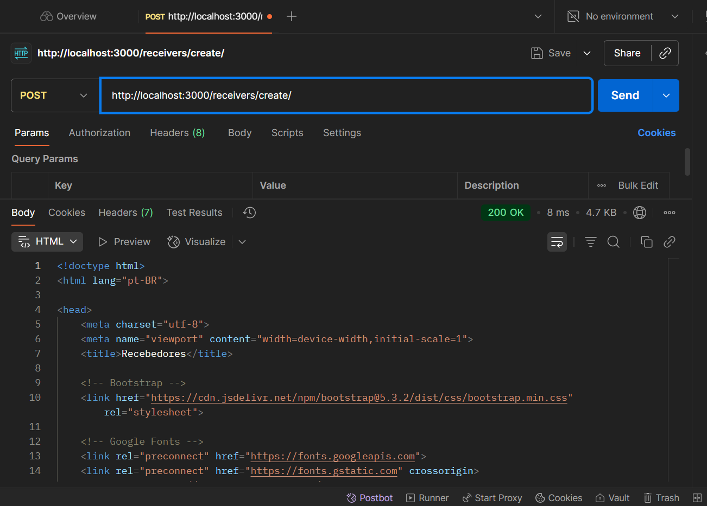
</div>

<div align="center">
<sub>Fonte: Postman</sub>
</div>

<div align="center">
<sub>Figura 06: Segundo teste com POST.</sub>
</div>
<div align="center">
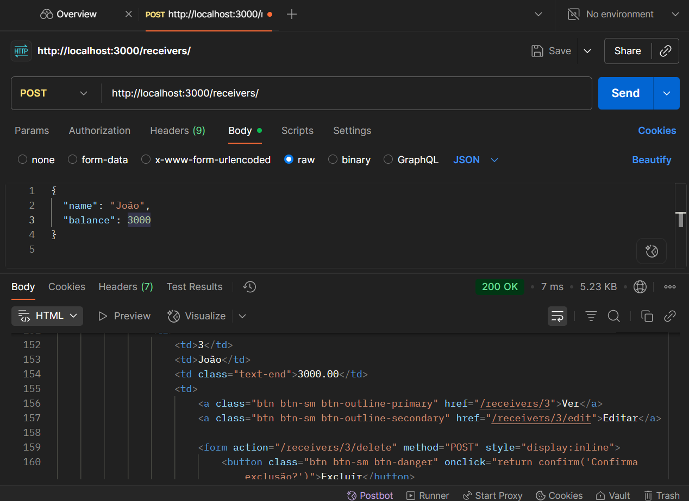
</div>

<div align="center">
<sub>Fonte: Postman</sub>
</div>

### 4.5. Front-end

Apesar de não ter sido um requisito, decidi fazer uma interface visual usando EJS, pois acredito que facilita muito a usabilidade. 

No desenvolvimento do front end, busquei utilizar as cores da LocPay (#074377, #80c2f4), além das fontes Montserrat e Arial. 

Criei 3 páginas principais, a homepage (`/`), a página de operações (`/operations/create`) e a página de recebedores (`/receivers`). 

A imagem da logo da locpay foi adicionada como arquivo estático no app.js, com `app.use(express.static(path.join(__dirname, 'public')));`.

## 5. O website em si

Abaixo, segue um detalhamento maior de cada parte do website.

### 5.1. Views (EJS)

#### layout.ejs
Template principal que envolve todas as páginas, contendo:
- Área `<%- body %>` para renderizar as demais views
- Renderização automática de `title` da página

#### index.ejs
Página inicial estática, estilizada conforme design detalhado na seção `4.5.`.

<div align="center">
<sub>Figura 07: Página inicial.</sub>
</div>
<div align="center">
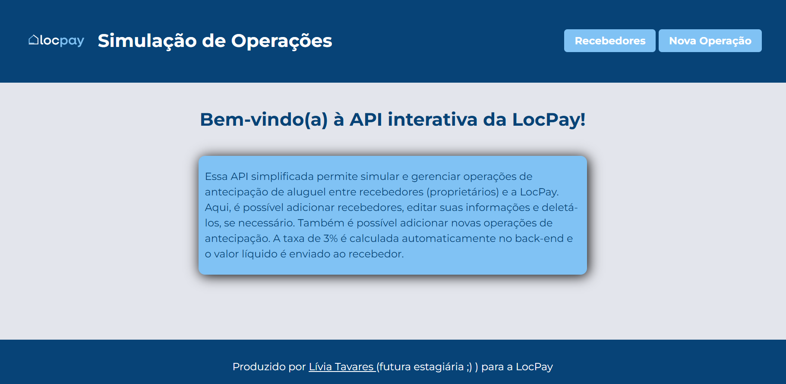
</div>

<div align="center">
<sub>Fonte: a autora</sub>
</div>

#### receivers/
- `index.ejs`: Página da lista de recebedores
- `show.ejs`: Informações do recebedor e histórico de operações
- `edit.ejs`: Formulário de edição do recebedor
- `create.ejs`: Criar novo recebedor

<div align="center">
<sub>Figura 08: Lista de recebedores.</sub>
</div>
<div align="center">
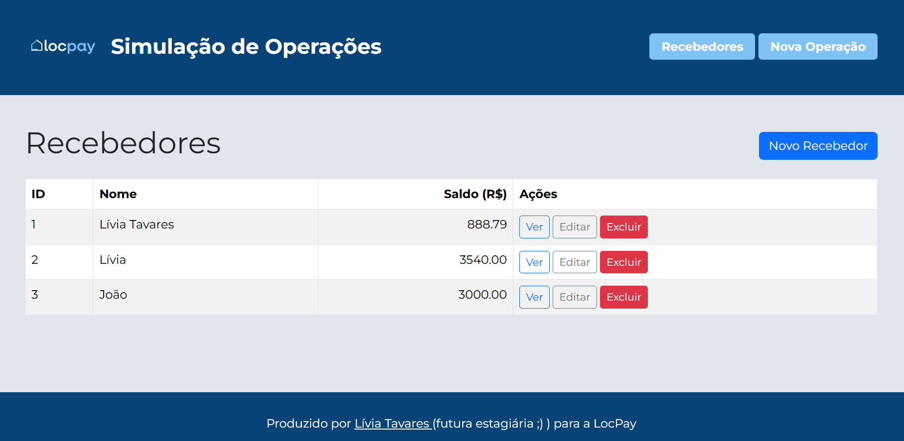
</div>

<div align="center">
<sub>Fonte: a autora.</sub>
</div>

<div align="center">
<sub>Figura 09: Histórico de recebimentos.</sub>
</div>
<div align="center">
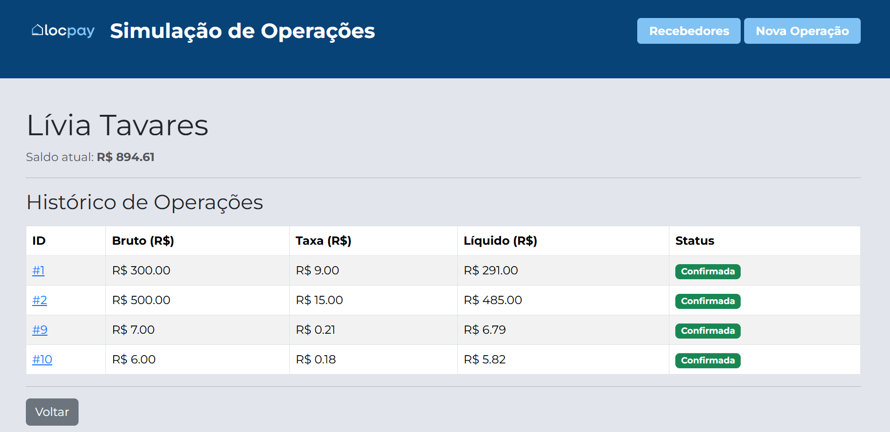
</div>

<div align="center">
<sub>Fonte: a autora.</sub>
</div>

<div align="center">
<sub>Figura 10: Página de edição.</sub>
</div>
<div align="center">
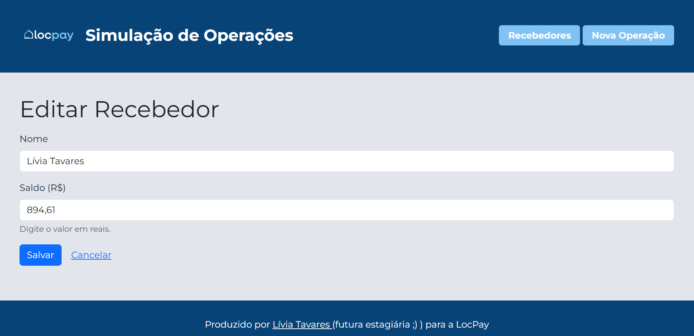
</div>

<div align="center">
<sub>Fonte: a autora.</sub>
</div>

<div align="center">
<sub>Figura 11: Página inicial.</sub>
</div>
<div align="center">
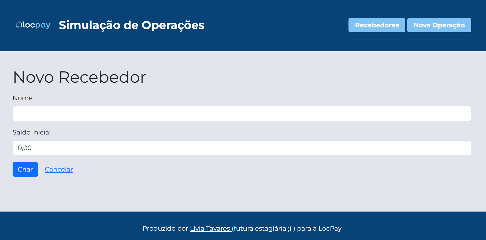
</div>

<div align="center">
<sub>Fonte: a autora.</sub>
</div>


#### operations/
- `create.ejs`: Criar operação
- `show.ejs`: Detalhes da operação + botão “Confirmar”

<div align="center">
<sub>Figura 12: Criar operação.</sub>
</div>
<div align="center">
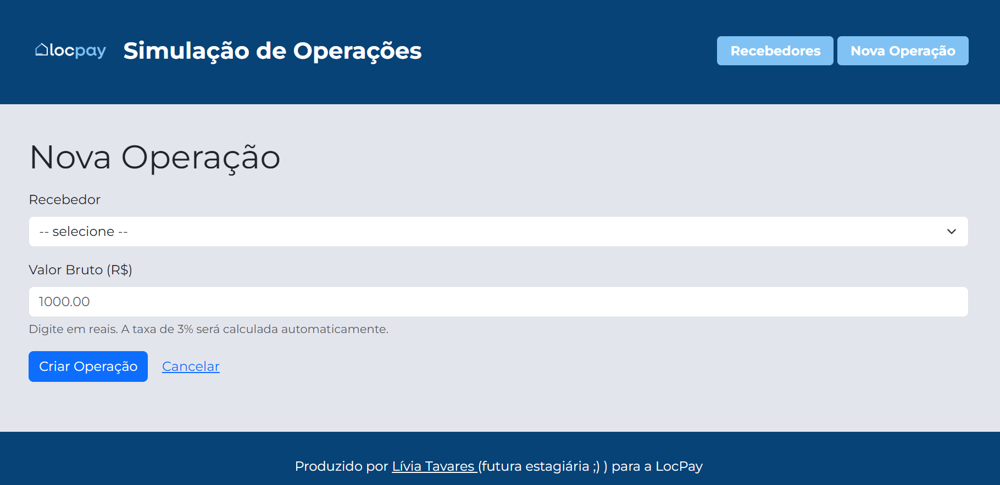
</div>

<div align="center">
<sub>Fonte: a autora.</sub>
</div>

<div align="center">
<sub>Figura 13: Confirmar operação.</sub>
</div>
<div align="center">
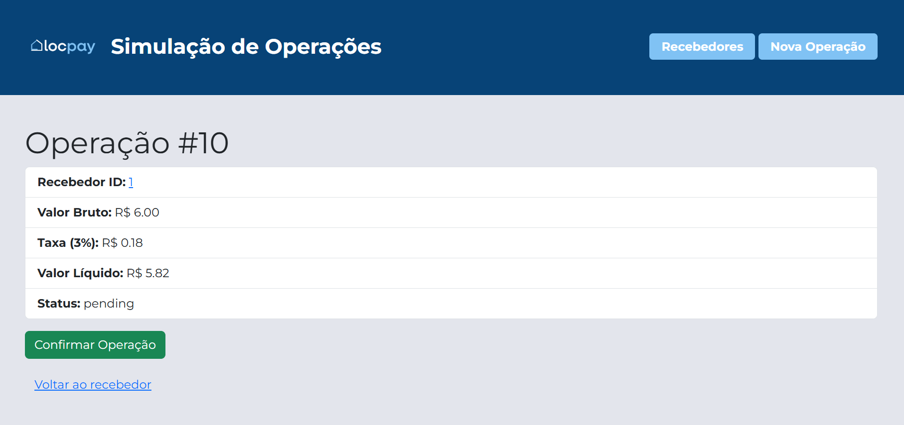
</div>

<div align="center">
<sub>Fonte: a autora.</sub>
</div>


### 5.2. Regras de Negócio

1. Usuário cria operação (`POST /operations`)
2. Backend converte valor para centavos
3. Calcula taxa de 3%
4. Salva com status "pending"
5. Em `POST /operations/:id/confirm`, o saldo do recebedor é atualizado

#### Recebedores

- Possuem `name` e `balance` (armazenado em centavos)
- Usuário sempre digita valores em reais, que são convertidos automaticamente para centavos
- Ao confirmar uma operação, o saldo aumenta.

#### Operações

Cada operação possui:

| Campo | Descrição |
|-------|------------|
| receiver_id | id do dono da operação |
| gross_value | Valor bruto em centavos |
| fee | Taxa de 3% |
| net_value | Valor líquido (bruto − taxa) |
| status | `pending` ou `confirmed` |


### 5.3. Rotas

#### Recebedores

| Rota | Método | Descrição |
|------|--------|------------|
| `/receivers` | GET | Lista todos |
| `/receivers/create` | GET | Formulário de criação |
| `/receivers` | POST | Criação |
| `/receivers/:id` | GET | Perfil + histórico |
| `/receivers/:id/edit` | GET | Editar |
| `/receivers/:id` | PUT | Atualizar |
| `/receivers/:id/delete` | DELETE | Deletar |

#### Operações

| Rota | Método | Descrição |
|------|--------|------------|
| `/operations/create` | GET | Formulário |
| `/operations/:id` | GET | Exibe detalhes |
| `/operations/:id/confirm` | POST | Confirma e credita recebedor |

### 5.4. Banco de Dados

#### Tabela `receivers`
```sql
id INTEGER PRIMARY KEY,
name TEXT,
balance INTEGER  -- sempre em centavos
```

#### Tabela `operations`

```sql
id INTEGER PRIMARY KEY,
receiver_id INTEGER,
gross_value INTEGER,
fee INTEGER,
net_value INTEGER,
status TEXT,   -- pending / confirmed
created_at TEXT
```

### 5.5. Controllers

#### receiversController.js

- Carrega dados do banco

- Converte valores em centavos ou reais para exibir e salvar

- Mostra histórico completo de operações

#### operationsController.js

- Aplica regras de negócio (3% de taxa)

- Atualiza saldo do recebedor

- Exibe detalhes de cada operação


## 6. Como Rodar o projeto

1. Clone este repositório utilizando o terminal da IDE, utilizando o comando `git clone https://github.com/liviatavares/locpay-summer-tech.git`.

2. Depois, crie um arquivo `.env` que contém o seguinte: 
`DATABASE_FILE=./database/database.db`

3. Depois, instale as dependências necessárias no terminal.

```
npm install
npm install ejs express
```

4. Por último, rode o arquivo fonte do projeto utilizando `node app.js` e acesse `http://localhost:3000/`.

## 7. Conclusão

O desenvolvimento desta aplicação web para simulação de operações de antecipação da LocPay me permitiu consolidar diversos conhecimentos práticos, tanto em back-end quanto em front-end. 

Como próximos passos para implementação real, poderia-se incluir:

- Implementar autenticação de usuários para restringir acesso às operações.

- Fazer novas regras de negócios com base no perfil do usuário.

- Adicionar filtros e buscas no histórico de recebedores.

- Incluir gráficos para visualização de operações e saldos.

- Melhorar responsividade da interface para dispositivos móveis.

